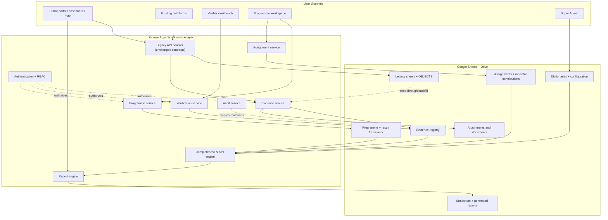
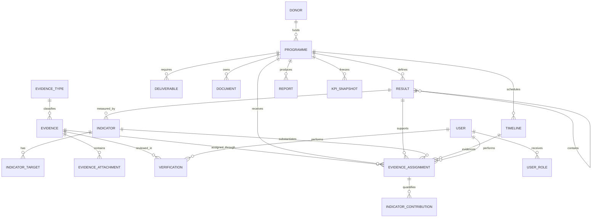
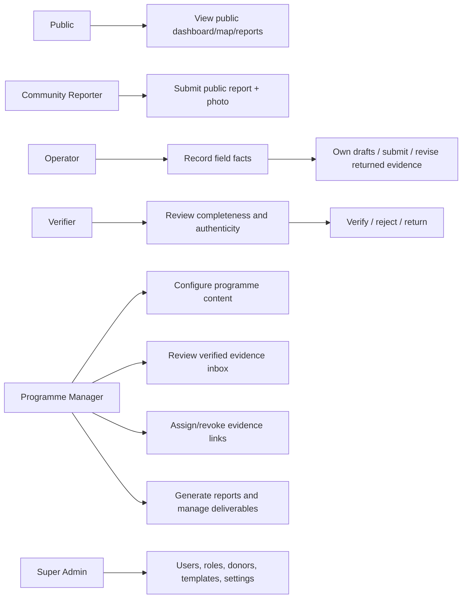
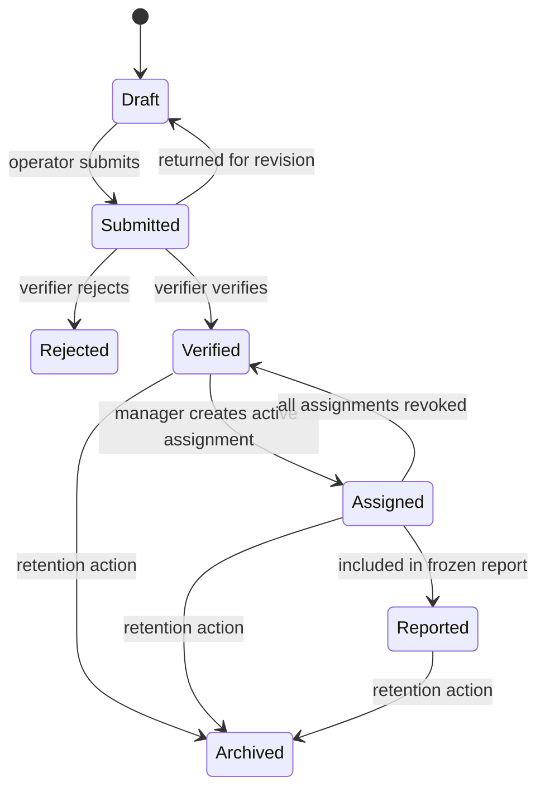
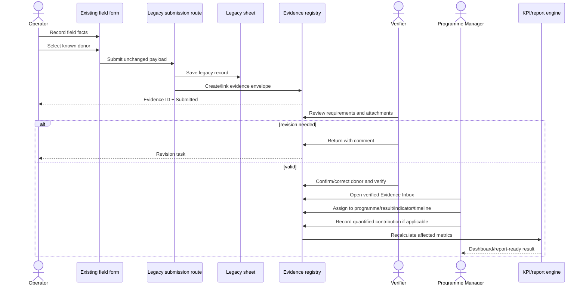
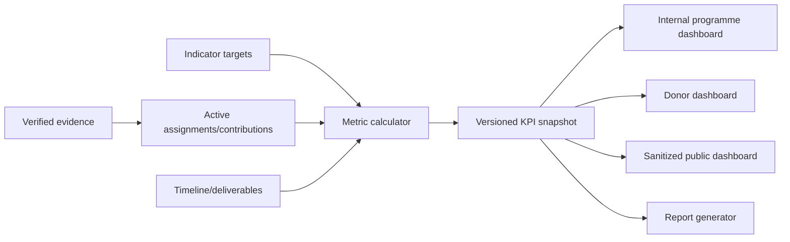

# YG-IPEMS Master Architecture V1.0

**Yayasan Gambut – Integrated Programme & Evidence Management System**  
**Status:** Architecture proposal — approval required before coding  
**Date:** 26 July 2026  
**Architecture gate:** No application implementation is authorized by this document.

## Executive decision

YG-IPEMS will be an additive programme-and-evidence layer above the stable YG GeoPortal. The existing WebGIS remains the spatial engine and all existing forms remain field-data entry points. Every submission becomes evidence first. Only a Programme Manager may later assign verified evidence to a programme, result-chain node, indicator, or timeline item.

The first release keeps the current static/PWA frontend, Google Apps Script service, Google Sheets database, and Google Drive attachments. New modules use new sheets and versioned API operations. Existing routes, columns, status values, GeoJSON, dashboards, and map behavior remain readable and operational.

### Non-negotiable invariants

1. Proposal defines targets; evidence defines achievements.
2. Field forms may record the donor known by the field team, but never write programme, output, indicator, logframe, budget, or timeline assignments.
3. Operator screens may expose the existing donor selector, but do not expose output, outcome, indicator, logframe, budget, or contractual timeline concepts.
4. Verification and programme assignment are separate actions.
5. Existing identifiers and records are never rewritten in place during migration.
6. Configuration, not source code, defines new donors, programmes, indicators, evidence types, and completeness rules.
7. Public APIs disclose only approved public fields.
8. Coding begins only after formal approval of this architecture package.

## Current-system baseline

The repository inspection found these compatibility contracts:

- Static HTML/CSS/JavaScript frontend with PWA/offline support.
- Google Apps Script endpoint currently consumed by the frontend.
- Existing public GET/JSONP routes: `objects`, `public-reports`, `public-updates`, `dashboard-summary`, public content, and pre/post-test routes.
- Existing POST behavior for report submission, editor authentication, master-object updates, content management, GitHub synchronization, and pre/post-test operations.
- `Laporan Masuk`, a 32-column report sheet used by community, monitoring, activity, document, photo, verification, and publication workflows.
- `OBJECTS`, a 24-column master spatial-object sheet.
- `CHANGE_LOG`, an object revision audit sheet.
- `TEST_SESSIONS`, `TEST_QUESTIONS`, and `TEST_RESPONSES`.
- Google Drive folders for report photos and capacity-building documents.
- Repository GeoJSON and JSON files that remain current map/dashboard sources.
- Existing donor/programme summaries in `data/donors.json`; these are presentation data, not yet a transactional programme registry.

The baseline is a production contract. IPEMS must wrap and extend it.

---

# 1. Revised System Architecture



### Architectural layers

| Layer | Responsibility | Rule |
|---|---|---|
| Collection | Existing monitoring, planting, nursery, activity, community, biodiversity, and media forms | Collect facts only |
| Evidence | Canonical evidence envelope, attachments, geometry, quality, completeness | System of record for achievements |
| Verification | Review, return, reject, verify | Cannot assign programme |
| Programme | Donors, programmes, results chain, timeline, deliverables | Stores targets and obligations |
| Assignment | Links verified evidence to programme structures | Many-to-many and auditable |
| Analytics | KPI calculations and snapshots | Reproducible from evidence + targets |
| Reporting | Period and donor reports | Uses frozen snapshots and cited evidence |
| Public | Sanitized maps, dashboard, public reports | No private or draft data |

### Deployment view

Release 1 remains Google-friendly:

- GitHub Pages/custom domain: static WebGIS and new workspace screens.
- Google Apps Script: API façade and business rules.
- Google Sheets: configuration and relational-style tables.
- Google Drive: original files and generated reports.
- CacheService/PropertiesService: short-lived reads, configuration version, locks, and secrets.
- Optional future AI import service: isolated adapter; never required for core operations.

### Key boundaries

- **Evidence registry versus source record:** the registry references a legacy report using `Source_Record_ID`; it does not copy and overwrite the original row.
- **Donor metadata versus programme assignment:** the donor selected in a field form is retained as evidence metadata and verified by an admin/verifier. It is not an output or indicator assignment. Programme/result assignments live in `TBL_EVIDENCE_ASSIGNMENT`.
- **Target versus achievement:** targets live in indicator target rows. Achievements are calculated from verified, assigned contributions.
- **Document versus evidence:** a file is an attachment; the evidence record supplies meaning, provenance, state, and review history.

---

# 2. Database Schema

Google Sheets acts as a lightweight relational store. Tables are intentionally denormalized where this improves Apps Script reliability, but repeating relationships use link tables.

## Core tables

| Sheet/table | Primary key | Purpose | Principal fields |
|---|---|---|---|
| `TBL_DONOR` | `Donor_ID` | Donor master | Code, Name, Status, Contact_JSON |
| `TBL_PROGRAMME` | `Programme_ID` | Programme workspace | Donor_ID, Code, Name, Start_Date, End_Date, Status, Manager_User_ID, Currency, Config_JSON |
| `TBL_RESULT` | `Result_ID` | Goal/outcome/output/activity hierarchy | Programme_ID, Parent_Result_ID, Result_Type, Code, Title, Description, Sort_Order |
| `TBL_INDICATOR` | `Indicator_ID` | Indicator definition | Programme_ID, Result_ID, Code, Name, Unit, Aggregation_Method, Disaggregation_JSON, Baseline, MoV, Frequency |
| `TBL_INDICATOR_TARGET` | `Target_ID` | Time/location targets | Indicator_ID, Period_Start, Period_End, Village_ID, Target_Value, Notes |
| `TBL_TIMELINE` | `Timeline_ID` | Milestones and workplan | Programme_ID, Result_ID, Title, Start_Date, End_Date, Owner_User_ID, Status, Weight |
| `TBL_DELIVERABLE` | `Deliverable_ID` | Contractual outputs | Programme_ID, Timeline_ID, Title, Due_Date, Status, Acceptance_Criteria, Document_ID |
| `TBL_EVIDENCE` | `Evidence_ID` | Canonical evidence envelope | Evidence_Type_ID, Title, Village_ID, Reported_Donor_ID, Donor_Verification_Status, Reporter_User_ID, Submitted_At, Status, Quality_Status, Completeness_Pct, Source, Source_Record_ID, Object_ID, Geometry_GeoJSON, Visibility |
| `TBL_EVIDENCE_ATTACHMENT` | `Attachment_ID` | Files and links | Evidence_ID, Attachment_Type, File_Name, Drive_File_ID, URL, MIME_Type, Version, Checksum, Uploaded_At |
| `TBL_EVIDENCE_ASSIGNMENT` | `Assignment_ID` | Evidence-to-programme link | Evidence_ID, Programme_ID, Result_ID, Activity_Result_ID, Indicator_ID, Timeline_ID, Assigned_By, Assigned_At, Status |
| `TBL_INDICATOR_CONTRIBUTION` | `Contribution_ID` | Quantified achievement | Assignment_ID, Indicator_ID, Value, Unit, Numerator, Denominator, Disaggregation_JSON, Measurement_Date, Calculation_Note |
| `TBL_VERIFICATION` | `Verification_ID` | Immutable review events | Evidence_ID, Decision, Reviewer_User_ID, Reviewed_At, Comment, Rule_Result_JSON |
| `TBL_DOCUMENT` | `Document_ID` | Programme document register | Programme_ID, Document_Type, Title, Drive_File_ID, Version, Status, Effective_Date, Visibility |
| `TBL_REPORT` | `Report_ID` | Report definition and output | Programme_ID, Report_Type, Period_Start, Period_End, Status, Template_ID, Drive_File_ID, Snapshot_ID, Generated_At |
| `TBL_KPI_SNAPSHOT` | `Snapshot_ID` | Frozen dashboard/report metrics | Programme_ID, As_Of, Scope_JSON, Metrics_JSON, Evidence_Set_Hash, Created_At |

## Configuration and governance tables

| Sheet/table | Purpose |
|---|---|
| `CFG_EVIDENCE_TYPE` | Evidence codes, labels, categories, active state, handler/config |
| `CFG_EVIDENCE_REQUIREMENT` | Required metadata/attachments, weights, applicability, validation rules |
| `CFG_STATUS_TRANSITION` | Allowed state transitions by role |
| `CFG_REPORT_TEMPLATE` | Report sections, indicator mapping, language, branding |
| `CFG_PROGRAMME_TEMPLATE` | Reusable result-chain/timeline/deliverable structures |
| `CFG_MASTER_DATA` | Villages, units, activity types, document types, visibility values |
| `TBL_USER` | User identity, name, email, state |
| `TBL_USER_ROLE` | User-to-role and optional programme scope |
| `TBL_AUDIT_LOG` | Append-only mutations, actor, before/after JSON, request ID |
| `TBL_IMPORT_JOB` | Proposal/import job, source document, state, extraction JSON, review decision |
| `TBL_IDEMPOTENCY` | Request key and saved response for safe retry |

## Legacy tables retained

`Laporan Masuk`, `OBJECTS`, `CHANGE_LOG`, `TEST_SESSIONS`, `TEST_QUESTIONS`, and `TEST_RESPONSES` remain unchanged in Release 1. New columns must not be inserted into their established ranges. Cross-system relationships use their existing IDs.

## Data constraints

- IDs are immutable human-readable UUID-like strings, e.g. `EV-20260726-...`.
- Dates are stored as ISO 8601 or real Sheet dates; API responses normalize to ISO 8601.
- Geometry is GeoJSON in WGS84 (`EPSG:4326`).
- Money stores numeric value plus currency; never formatted text.
- Every mutation records `Created_At/By`, `Updated_At/By`, and `Revision`.
- Link-table records use soft status (`Active`, `Revoked`) rather than deletion.
- JSON fields are for variable configuration, not hidden core relationships.
- Apps Script `LockService` protects ID generation and multi-sheet mutations.

---

# 3. Entity Relationship Diagram



Cardinality decisions:

- One evidence item may support multiple programmes or indicators, but each link is explicit.
- One assignment may contribute zero or more measurements.
- Evidence verification is a history of decisions, not one overwritten verifier field.
- Results use one table with a constrained type and parent, avoiding four nearly identical sheets.

---

# 4. User Role Diagram



## Permission matrix

| Capability | Public | Community | Operator | Verifier | Programme Manager | Super Admin |
|---|---:|---:|---:|---:|---:|---:|
| View public data | ✓ | ✓ | ✓ | ✓ | ✓ | ✓ |
| Submit community report |  | ✓ | ✓ |  |  |  |
| Create/edit own field evidence |  |  | ✓ |  |  |  |
| Select/view donor on field evidence |  |  | ✓ | ✓ | ✓ | ✓ |
| View programme/LFA |  |  |  | scoped read | ✓ | ✓ |
| Verify/reject/return evidence |  |  |  | ✓ | review only | override by policy only |
| Assign evidence |  |  |  |  | ✓ | ✓ |
| Configure targets/timeline |  |  |  |  | ✓ | ✓ |
| Generate programme reports |  |  |  |  | ✓ | ✓ |
| Manage donors/templates/users |  |  |  |  |  | ✓ |

Operator screens retain the existing donor field because the field team knows the funding source. Operator API responses and screens must still omit programme result structures: goal, outcome, output, indicator, budget, and contractual timeline. The verifier/admin confirms or corrects the selected donor during evidence verification.

---

# 5. Evidence Dictionary

## Common metadata

Every evidence record has: ID, type, title, village, reported donor, donor-verification state, reporter, verifier history, submission date, status, object reference, geometry, source, attachments, quality state, completeness score, and visibility. The reported donor is retained from the existing form and confirmed or corrected by the verifier/admin. Programme, output, activity, indicator, and timeline links remain separate assignments made in the Programme Workspace.

## Initial type dictionary

| Code | Type/category | Required metadata | Required attachments | Means of verification | Initial completeness rule | Verification rule |
|---|---|---|---|---|---|---|
| `SP-MON` | Monitoring / SP | date, location, object, condition, recommendation | geotagged photo | site record + object match | metadata 60%, photo 40% | geometry valid; object exists or exception noted |
| `SP-PLT` | Planting / SP | date, village, species, planted count, area/point | photo, planting record | field record + spatial footprint | metadata 60%, photo 20%, record 20% | nonnegative count; valid geometry |
| `SP-NUR` | Nursery / SP | date, village, species, stock/count, condition | photo | stock record + site photo | metadata 70%, photo 30% | counts coherent; location valid |
| `SP-CBL` | Canal Block / SP | date, object, condition, dimensions | photo | inspection record | metadata 60%, photo 40% | object/layer compatibility |
| `SP-FDR` | FDRS / SP | timestamp, station/object, measurement, unit | instrument/photo optional by config | sensor/field sheet | metadata 80%, attachment 20% | value range and unit check |
| `SP-HYD` | Hydrology / SP | timestamp, location, parameter, value, unit | field sheet/photo | measurement sheet | metadata 80%, attachment 20% | range and calibration note |
| `SP-PAT` | Patrol / SP | date, route/location, team, finding | track/photo if finding | patrol log | metadata 70%, attachment 30% | route or point present |
| `SP-SUR` | Survey / SP | date, method, location, enumerator | dataset/form | survey instrument | metadata 50%, file 50% | consent/privacy classification |
| `AC-TRN` | Training / AC | title, date, location, facilitator, participant counts | attendance, photo, module, pre/post results when configured | signed attendance + learning results | weighted requirement profile | counts reconcile; mandatory docs readable |
| `AC-WKS` | Workshop / AC | title, date, location, participants, agenda | attendance, photo, agenda/output | attendance + workshop output | metadata 50%, files 50% | output documented |
| `AC-FGD` | FGD / AC | topic, date, location, participant profile | attendance, photo, minutes | minutes + attendance | metadata 50%, files 50% | consent and minutes present |
| `AC-MTG` | Meeting / AC | subject, date, participants, decisions | minutes | approved minutes | metadata 60%, minutes 40% | decisions/actions identified |
| `AC-CON` | Consultation / AC | purpose, date, stakeholders, outcome | notes/photo as configured | consultation note | configurable | stakeholder and outcome present |
| `AC-EXV` | Exchange Visit / AC | host, date, participants, learning objective | attendance, photo, learning note | visit record | configurable | learning outcome present |
| `AC-SOC` | Socialization / AC | topic, date, audience, reach | attendance/photo/material | event record | configurable | reach supported |
| `AC-DIS` | Dissemination / AC | product/message, channel, date, reach | publication/screenshot | distribution record | configurable | URL/file accessible |
| `BI-OBS` | Biodiversity / BI | date, observer, species/taxon, count, method, location | photo/audio where available | observation protocol | metadata 80%, media 20% | taxon/method/location review |
| `CM-BPL` | Business Plan / CM | group, village, version, approval state | plan document, approval | signed/approved plan | document 70%, metadata 30% | version and approval validated |
| `CM-LIV` | Livelihood / CM | group, activity, date, beneficiary counts | photo/record | beneficiary/activity record | configurable | no duplicate beneficiary aggregation |
| `CM-MKT` | Marketing / CM | product, channel, period, result | sales/promotion record | transaction or campaign proof | configurable | private financial fields protected |
| `CM-PRD` | Product Development / CM | product, stage, group, date | prototype/photo/specification | product record | configurable | stage and ownership clear |
| `CM-KUP` | KUPS / CM | group, legal/status data, activity | decree/profile | official/group record | configurable | document validity |
| `CM-FGR` | Farmer Group / CM | group, village, membership summary | decree/list | group register | configurable | privacy-safe member handling |
| `DC-PRO` | Proposal / DC | title, donor, version, date | document | approved proposal | metadata 30%, file 70% | Programme Manager provenance |
| `DC-AGR` | Agreement / DC | parties, version, effective date | signed agreement | signed agreement | metadata 30%, file 70% | signature/version access restricted |
| `DC-BPL` | Business Plan / DC | owner, version, date | document | approved plan | configurable | version/approval |
| `DC-RDM` | Roadmap / DC | scope, period, version | document | approved roadmap | configurable | version |
| `DC-SOP` | SOP / DC | owner, effective date, version | approved SOP | approval record | configurable | active version |
| `DC-MOU` | MoU / DC | parties, term, version | signed MoU | signed MoU | configurable | signatures/access |
| `DC-BAS` | Baseline / DC | scope, period, method | report/dataset | approved baseline | configurable | method and dataset traceability |
| `DC-END` | Endline / DC | scope, period, method | report/dataset | approved endline | configurable | comparable baseline mapping |
| `DC-RES` | Research / DC | title, authors, method, date | paper/dataset | publication/research file | configurable | provenance and ethics |
| `DC-PBR` | Policy Brief / DC | title, issue, audience, version | brief | approved publication | configurable | publication approval |
| `DC-MAN` | Manual / DC | title, audience, version | manual | approved manual | configurable | active version |
| `DC-GDL` | Guideline / DC | title, owner, version | guideline | approved guideline | configurable | active version |
| `MG-PRG` | Progress Report / MG | programme, period, version | report | approved report | configurable | evidence citations resolvable |
| `MG-FIN` | Final Report / MG | programme, period, version | report | accepted report | configurable | snapshot frozen |
| `MG-FNR` | Financial Report / MG | programme, period, currency | restricted report | finance approval | configurable | restricted verifier |
| `MG-AUD` | Audit / MG | scope, period, auditor | restricted report | signed audit | configurable | access and authenticity |
| `MG-INV` | Invoice / MG | vendor, date, amount, currency | invoice | finance record | configurable | duplicate/reference check |
| `MG-RCP` | Receipt / MG | vendor, date, amount, currency | receipt | finance record | configurable | duplicate/reference check |
| `MG-MIN` | Minutes / MG | meeting, date, approver | minutes | approved minutes | configurable | version/approval |
| `MD-PHO` | Photo / MD | date, creator, location/subject, consent | image | original file | metadata 40%, file 60% | file readable; consent/visibility |
| `MD-DRO` | Drone / MD | date, pilot/source, footprint, purpose | imagery | original imagery/flight record | configurable | legal/privacy metadata |
| `MD-VID` | Video / MD | date, creator, subject, consent | video | original file | configurable | file accessible |
| `MD-AUD` | Audio / MD | date, creator, subject, consent | audio | original file | configurable | file accessible |
| `MD-PRS` | Presentation / MD | title, event, version | slide file | presentation file | configurable | version and source |
| `SY-DSH` | Dashboard / SY | scope, as-of date, snapshot ID | generated artifact | KPI snapshot | system = 100% | reproducible hash |
| `SY-PRG` | Progress / SY | scope, period, snapshot ID | generated artifact | calculation trace | system = 100% | calculation version |
| `SY-KPI` | KPI / SY | indicator, as-of, value, method | calculation trace | verified contributions | system = 100% | no unverified contribution |
| `SY-CAR` | Carbon Estimate / SY | model, version, area, period | calculation artifact | model inputs | rule-set-specific | model/version/input trace |
| `SY-CLI` | Climate Impact / SY | method, scope, period | calculation artifact | verified inputs | rule-set-specific | methodology trace |
| `SY-SDG` | SDG / SY | SDG target mapping, scope, period | mapping artifact | verified indicator mapping | system = 100% | configuration approved |
| `SY-RPT` | Generated Report / SY | report ID, template, period, snapshot | generated file | frozen snapshot | system = 100% | citations and hash valid |

## Completeness engine

`CFG_EVIDENCE_REQUIREMENT` contains one row per rule:

`Evidence_Type_ID`, `Requirement_Key`, `Requirement_Kind`, `Required`, `Weight`, `Condition_JSON`, `Validation_Rule`, `Active_From`, `Active_To`.

Score:

`Completeness % = sum(weight of satisfied applicable requirements) / sum(weight of applicable requirements) × 100`

Completeness is advisory until submission and mandatory at verification. A verifier may override a machine rule only with a reason; the override is audited. “Complete” does not mean “Verified.”

## State machine



`Need Revision`, `Incomplete`, `Complete`, and `Verified` are quality/review concepts, not substitutes for workflow status. Legacy Indonesian statuses remain mapped through an adapter.

---

# 6. Evidence Flow Diagram



### Failure handling

- If legacy save succeeds but registry creation fails, an append-only reconciliation queue retries using the legacy report ID as idempotency key.
- If file upload fails, evidence remains Draft/Incomplete; no partial verification.
- Repeated submissions with the same idempotency key return the original response.
- Revoking an assignment recalculates affected KPI snapshots but cannot alter frozen reports.

---

# 7. Programme Workspace Wireframe

```text
┌───────────────────────────────────────────────────────────────────────────┐
│ Programme: [Code] Name       Donor | Dates | Status | Manager    [Actions]│
├───────────────┬───────────────────────────────────────────────────────────┤
│ Overview      │ Health: Timeline  Evidence  Deliverables  KPI             │
│ Proposal      │ ┌──────────┐ ┌──────────┐ ┌──────────┐ ┌──────────┐       │
│ Agreement     │ │ Progress │ │ Due soon │ │ Inbox    │ │ Quality  │       │
│ Timeline      │ └──────────┘ └──────────┘ └──────────┘ └──────────┘       │
│ Logframe      │                                                           │
│ Evidence Inbox│ Current tab content                                       │
│ Deliverables  │ Filters | Search | Saved views                            │
│ Documents     │ --------------------------------------------------------- │
│ Dashboard     │ Table / cards / timeline / detail drawer                  │
│ Reports       │                                                           │
└───────────────┴───────────────────────────────────────────────────────────┘
```

### Tab behavior

- **Overview:** programme facts, alerts, next milestones, evidence health.
- **Proposal/Agreement:** versioned restricted documents; targets are explicitly approved, never silently imported.
- **Timeline:** milestone/workplan view linked to result nodes and deliverables.
- **Logical Framework:** hierarchical goal → outcome → output → activity with indicators and MoV.
- **Evidence Inbox:** verified, unassigned evidence; filters by type, village, date, object, completeness, and quality; bulk assignment allowed only after validation.
- **Deliverables:** due dates, acceptance criteria, evidence coverage, and report inclusion.
- **Documents:** version register, visibility, approvals.
- **Dashboard:** target-versus-achievement and drill-down to cited evidence.
- **Reports:** report periods, frozen snapshots, generation state, approval, download.

The Operator never sees this workspace. The donor selector remains in the field form, while programme outputs and indicators remain hidden. The Verifier confirms or corrects donor metadata; the Programme Manager subsequently assigns verified evidence to the appropriate programme structure.

---

# 8. Dashboard Architecture



## Dashboard domains

| Domain | Primary measures | Drill-down |
|---|---|---|
| Overview | programme health, target progress, evidence quality | programme/result |
| Progress | target vs achieved, baseline, variance | indicator → contributions |
| Timeline | planned vs completed milestones | milestone → evidence |
| Activities | count, participants, disaggregation | activity → attendance/evidence |
| Evidence | submitted/verified/assigned/reported, completeness | evidence detail |
| Monitoring | object condition, latest visit, action required | map object → monitoring history |
| Community | livelihoods, groups, products, reach | village/group |
| Climate | configured climate metrics | method/input evidence |
| Carbon | model/version estimates | area/model/input |
| SDGs | programme indicators mapped to SDG targets | SDG mapping |
| Media | approved visual evidence | gallery/evidence |
| Reports | reporting calendar and status | report/snapshot |

## Calculation rules

- Only `Verified` evidence with an active assignment contributes.
- Aggregation method is configured per indicator: sum, distinct count, latest value, average, percentage, milestone, or formula.
- Distinct-person metrics require privacy-safe participant keys and deduplication rules.
- A contribution retains unit, period, geography, disaggregation, and calculation note.
- Every displayed KPI exposes “as of,” target, method, and evidence count.
- Public dashboards use a separate visibility filter and precomputed snapshot.
- Frozen report snapshots are immutable; later corrections produce a new version.

---

# 9. API Structure

The existing Apps Script URL and legacy query routes remain valid. New APIs use an explicit version and resource/action envelope while remaining compatible with Apps Script limitations.

## Legacy contract: unchanged

| Method | Existing route/action | Compatibility decision |
|---|---|---|
| GET | `?page=objects` | unchanged JSON/JSONP shape |
| GET | `?page=public-reports` | unchanged GeoJSON feature collection |
| GET | `?page=public-updates` | unchanged |
| GET | `?page=dashboard-summary` | unchanged |
| GET | pre/post-test pages | unchanged |
| POST | existing report payload | unchanged input/response; internally creates evidence link |
| POST | editor/content/object/pre-post actions | unchanged |

## New versioned operations

Apps Script-compatible examples:

| Method | Operation | Roles |
|---|---|---|
| GET | `?api=v1&resource=evidence&id=...` | scoped |
| GET | `?api=v1&resource=evidence-inbox&...filters` | Programme Manager |
| POST | `action=v1-evidence-save` | Operator |
| POST | `action=v1-evidence-submit` | Operator |
| POST | `action=v1-evidence-review` | Verifier |
| POST | `action=v1-evidence-assign` | Programme Manager |
| POST | `action=v1-evidence-unassign` | Programme Manager |
| GET/POST | `resource/action=v1-programme-*` | Programme Manager/Admin |
| GET/POST | `resource/action=v1-result-*` | Programme Manager/Admin |
| GET/POST | `resource/action=v1-indicator-*` | Programme Manager/Admin |
| GET/POST | `resource/action=v1-timeline-*` | Programme Manager/Admin |
| GET/POST | `resource/action=v1-deliverable-*` | Programme Manager/Admin |
| POST | `action=v1-report-generate` | Programme Manager |
| GET | `?api=v1&resource=dashboard&programmeId=...` | scoped/public |
| GET/POST | `resource/action=v1-config-*` | Super Admin |

## Standard request/response

Requests include `requestId`, `idempotencyKey`, `expectedRevision`, and payload. Responses contain:

- `ok`
- `requestId`
- `data` or structured `error`
- `meta.timestamp`, `meta.apiVersion`, `meta.revision`

Error codes include `AUTH_REQUIRED`, `FORBIDDEN`, `VALIDATION_FAILED`, `REVISION_CONFLICT`, `NOT_FOUND`, `INVALID_TRANSITION`, `DUPLICATE_REQUEST`, and `INTERNAL_ERROR`.

## Security

- Replace shared static admin tokens with authenticated user sessions before exposing IPEMS mutations.
- Enforce RBAC server-side; hiding UI is insufficient.
- Programme scope is checked on every read/write.
- Restrict agreement, finance, audit, personal, and consent data.
- Validate MIME type, size, extension, and Drive ownership.
- Append an audit record for every mutation and security decision.
- JSONP remains only for existing public read routes; new private routes never use JSONP.
- Secrets move to Script Properties and are rotated; no new secrets enter source control.

---

# 10. Spreadsheet Structure

## Workbook layout

Recommended order:

1. `README_CONFIG` — version, owner, last migration, environment.
2. `CFG_*` sheets — protected configuration.
3. `TBL_DONOR`, `TBL_PROGRAMME`, result/indicator/timeline tables.
4. Evidence, verification, assignment, contribution tables.
5. Document, report, snapshot, audit, import, idempotency tables.
6. Existing legacy sheets, left in their current form.

## Conventions

- Row 1 contains stable machine headers; labels/translations live elsewhere.
- One logical record per row.
- No merged cells inside data tables.
- Protected header and formula columns.
- Data validation for enums and master-data keys.
- Filter views rather than manual sorting of source sheets.
- `Revision` increments on update; `Active` supports soft retirement.
- IDs, not row numbers, are references.
- JSON columns are compact and documented.
- Large attachments remain in Drive; Sheets store IDs/metadata only.
- Archive strategy is by year only after scale testing, with a unified read adapter.

## Minimum headers

```text
TBL_EVIDENCE
Evidence_ID | Evidence_Type_ID | Title | Village_ID | Reporter_User_ID |
Reported_Donor_ID | Donor_Verification_Status | Submitted_At | Status |
Quality_Status | Completeness_Pct | Source |
Source_Record_ID | Object_ID | Geometry_GeoJSON | Visibility |
Created_At | Created_By | Updated_At | Updated_By | Revision

TBL_EVIDENCE_ASSIGNMENT
Assignment_ID | Evidence_ID | Programme_ID | Result_ID | Activity_Result_ID |
Indicator_ID | Timeline_ID | Status | Assigned_At | Assigned_By |
Revoked_At | Revoked_By | Revocation_Reason | Revision

TBL_VERIFICATION
Verification_ID | Evidence_ID | Decision | Reviewer_User_ID | Reviewed_At |
Comment | Completeness_Pct | Rule_Result_JSON | Request_ID
```

## Drive structure

```text
YG-IPEMS/
  Evidence/YYYY/MM/EV-.../
  Programmes/Programme_ID/
    01 Proposal/
    02 Agreement/
    03 Deliverables/
    04 Reports/
  Generated Reports/Programme_ID/YYYY/
  Restricted Finance/Programme_ID/
```

Drive folder paths are organizational; database relationships use Drive file/folder IDs.

---

# 11. Migration Strategy

Migration is incremental, idempotent, reversible, and read-through.

## Steps

1. **Freeze and inventory:** export spreadsheet metadata, headers, row counts, IDs, Drive links, route samples, and frontend smoke-test results.
2. **Create additive schema:** add only new `CFG_*` and `TBL_*` sheets.
3. **Seed configuration:** evidence types, requirements, roles, statuses, villages, units.
4. **Create legacy mapping:** map each legacy report type/status to canonical evidence type/status without altering the source.
5. **Backfill registry:** create one evidence envelope per eligible legacy record using `Source='Legacy'` and the existing report ID.
6. **Reconcile:** compare counts, IDs, attachments, geometry, dates, and public visibility; log exceptions.
7. **Dual write:** existing submissions continue writing `Laporan Masuk`; the adapter creates `TBL_EVIDENCE` records. A retry queue covers partial failures.
8. **Shadow reads:** IPEMS screens read the new registry; existing WebGIS continues reading legacy APIs.
9. **Pilot:** one programme, limited users, no automatic donor reporting.
10. **Expand:** migrate programme structures and assignments only after manager review.
11. **Optional convergence:** after proven parity, legacy APIs may read from canonical stores through adapters, but their response shapes remain frozen.

## Idempotency

Backfill key: `LEGACY:<sheet>:<legacy-id>`. A unique index is simulated through cached lookup plus locked full-sheet confirmation. Rerunning migration updates only missing derived metadata; it never duplicates or rewrites source rows.

## Rollback

Disable new feature flags and dual-write trigger. Existing forms, legacy sheets, APIs, dashboards, maps, and files continue independently. New sheets remain for diagnosis; no destructive rollback is needed.

---

# 12. Backward Compatibility Plan

## Protected contracts

| Contract | Protection |
|---|---|
| Existing form fields, donor selector, and POST payload | retained through additive adapter; no required new field |
| `Laporan Masuk` columns A–AF | no reorder, rename, or insert |
| Existing Indonesian statuses | preserved; canonical mapping occurs internally |
| Existing public JSON/JSONP | golden response-contract tests |
| `OBJECTS` GeoJSON shape and IDs | unchanged adapter output |
| Map layer IDs/files | unchanged; IPEMS references their IDs |
| Dashboard calculations | existing dashboard remains active until signed parity |
| Old monitoring records | linked by report/object IDs; readable through old and new views |
| Existing Drive URLs | retained; new attachment registry references them |
| PWA/offline behavior | legacy asset paths retained and regression-tested |
| Pre/post-test workflows | retained; optionally linked as training evidence later |

## Compatibility test suite

- Golden fixtures for all public endpoint shapes.
- Submission smoke tests for monitoring, planting, nursery, activity, community, biodiversity, and media.
- Historical record sampling across years and types.
- Map-layer load, popup, filter, object matching, and geometry tests.
- Dashboard metric comparison against the current production output.
- Image/document URL access tests.
- Offline/PWA cache test.
- Dual-write reconciliation report with zero unexplained gaps.

No legacy route is deprecated in V1. Deprecation requires usage evidence, a published transition period, and explicit approval.

---

# 13. Risk Analysis

| Risk | Likelihood | Impact | Mitigation |
|---|---|---|---|
| Apps Script/Sheets scale and execution limits | High | High | batch reads/writes, caching, pagination, snapshots, load tests, archive plan |
| Shared/static token exposure in current source | High | High | migrate to session identity and Script Properties; rotate secrets |
| Dual-write partial failure | Medium | High | idempotency, retry queue, reconciliation dashboard |
| Legacy schema drift | Medium | High | header-based adapters, contract fixtures, schema-version check |
| Duplicate evidence or double-counted KPI | Medium | High | assignment/contribution uniqueness rules and distinct aggregation |
| Incorrect programme assignment | Medium | High | manager confirmation, revoke flow, audit log, bulk preview |
| Completeness mistaken for validity | Medium | Medium | separate score, quality state, and verifier decision |
| Sensitive agreements/finance/PII exposed | Medium | High | field-level response filtering, Drive ACLs, visibility classification |
| Unreliable Drive links/files | Medium | Medium | Drive IDs, checksum, access validation, file metadata |
| Proposal AI extraction hallucination | High | High | staging only; human approval before programme creation |
| Hardcoded donor logic returns | Medium | High | configuration tables and template-driven reports |
| KPI methodology inconsistency | Medium | High | versioned methods, units, contribution trace, frozen snapshots |
| User role conflict/verification bias | Medium | Medium | separation of duties and programme-scoped permissions |
| Offline duplicate submissions | Medium | Medium | client request ID and server idempotency |
| Spreadsheet manual edits bypass rules | High | Medium | protected ranges, audit, controlled admin UI, validation scans |
| Migration data loss | Low | Critical | copy/link only, backups, checksums, rollback feature flags |
| Public dashboard performance | Medium | Medium | sanitized precomputed snapshots and cache |

Go-live blockers: unresolved critical security issues, unexplained reconciliation gaps, broken legacy smoke tests, or unapproved KPI methods.

---

# 14. Implementation Phases

| Phase | Scope | Exit criteria |
|---|---|---|
| 0. Approval and baseline | Approve architecture, owners, glossary, security decisions; capture production contracts | signed architecture gate |
| 1. Foundation | New sheets, IDs, audit, RBAC/session design, feature flags, config registry | schema and security tests pass |
| 2. Evidence registry | Legacy mapping/backfill, dual write, attachments, completeness engine | reconciliation and form regression pass |
| 3. Verification | verifier queue, return/reject/verify, immutable history | separation-of-duties acceptance |
| 4. Programme workspace | donors, programmes, result chain, indicators, timeline, documents, deliverables | one programme configured without code |
| 5. Assignment and KPI | inbox, links, contributions, aggregations, snapshots | target/achievement trace validated |
| 6. Dashboard and reports | internal/donor/public views, monthly through final reports | report evidence citations and snapshot reproducibility |
| 7. Migration expansion | historical backfill and programme mapping | zero unexplained data gaps |
| 8. Hardening | load, security, privacy, backup, disaster recovery, training | go-live checklist approved |
| 9. Future import engine | proposal extraction to reviewable staging | human-approved accuracy benchmark |

Each phase is independently deployable behind a feature flag. Phases do not remove existing functionality.

---

# 15. Coding Roadmap

Coding remains blocked until this document is approved.

## Proposed work packages after approval

1. **Architecture decision records:** identity/session model, Sheet partition thresholds, privacy classification, KPI formula governance.
2. **Contract-test harness:** capture legacy endpoint and form fixtures before backend changes.
3. **Schema installer:** idempotently create/protect new sheets and seed dictionaries.
4. **Repository/data access layer:** header-based reads, batched writes, revisions, locks, idempotency.
5. **Authorization layer:** role and programme-scope guards on every new endpoint.
6. **Evidence adapter:** convert new and legacy submissions to canonical envelopes.
7. **Completeness engine:** config-driven rules and explainable result JSON.
8. **Verification service/UI:** queues, decisions, revision comments, audit history.
9. **Programme service/UI:** donor/programme/result/indicator/timeline/document/deliverable configuration.
10. **Assignment service/UI:** evidence inbox, assignment validation, contribution capture, revocation.
11. **KPI engine:** versioned aggregators, unit validation, snapshots, recalculation dependency map.
12. **Dashboard layer:** programme, donor, and sanitized public projections.
13. **Report engine:** templates, frozen snapshot, evidence citations, generated file registry.
14. **Migration/reconciliation tooling:** repeatable backfill, exception export, parity metrics.
15. **Operational hardening:** monitoring, quotas, backup/restore rehearsal, privacy review, user training.

## Definition of done for every work package

- Existing compatibility tests remain green.
- Server-side permission tests pass.
- Audit and idempotency behavior are verified.
- User-facing error and recovery behavior is documented.
- Data dictionary and API contract are updated.
- Deployment and rollback are rehearsed.
- No donor/programme rule is hardcoded.

---

# Approval Record

The following decisions require explicit stakeholder approval before implementation:

1. Approve evidence-first architecture and separation of verification from assignment.
2. Approve the additive Google Sheets/Apps Script V1 deployment.
3. Approve the canonical state model and legacy status mapping approach.
4. Approve the role matrix and separation of duties.
5. Approve the core schema, especially many-to-many evidence assignment and indicator contributions.
6. Approve the initial evidence dictionary and assign business owners to refine each rule.
7. Select the pilot programme and pilot users.
8. Approve the identity/security migration away from shared tokens.
9. Approve KPI calculation owners and public/private visibility policy.
10. Authorize Phase 0 completion and the start of coding.

**Architecture status:** `PROPOSED — NOT YET APPROVED`  
**Implementation status:** `BLOCKED BY ARCHITECTURE GATE`
